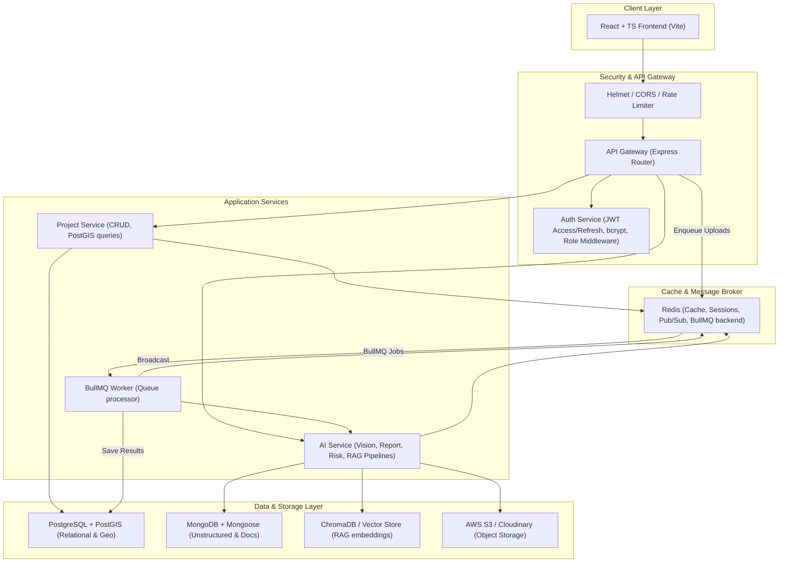

# Drone Intelligence Command Center (DICC)

[](https://github.com/YOUR_USERNAME/drone-intelligence-command-center/actions)

DICC is a production-grade enterprise SaaS platform designed for industrial asset inspection (mining, wind farms, solar fields, power lines) using drone data, custom Leaflet-based geospatial maps, and a multi-agent AI framework (Vision, Report, Risk Prediction, and RAG Chat Agents).

Built with a high-fidelity **glassmorphism dark interface**, the application runs a multi-database architecture (PostgreSQL + PostGIS, MongoDB, and Redis) with a complete background task queue system (BullMQ) to process heavy drone images asynchronously.

---

## 🛠️ Technology Stack

| Layer | Technologies |
| :--- | :--- |
| **Frontend** | React 18, TypeScript, Tailwind CSS, Zustand, Chart.js, Leaflet, Framer Motion |
| **Backend** | Node.js, Express, TypeScript, WebSockets (`ws`), Multer, Winston Logging, Morgan |
| **Databases** | PostgreSQL + PostGIS, MongoDB + Mongoose, In-Memory Vector Store Emulator |
| **Queue & Cache** | Redis, BullMQ (Task Queue & Workers) |
| **Testing** | Jest, Supertest (API), React Testing Library (Frontend) |
| **DevOps** | Docker, Docker Compose, GitHub Actions (CI/CD) |

---

## 🏗️ System Architecture



---

## 🚀 Key Features

1. **Operations Dashboard**: Statistics cards and Chart.js widgets tracking project statuses, defect categories, severity distributions, and monthly trends.
2. **Geospatial Leaflet Map**: Pulsing defect heatmaps, satellite/dark theme layers, polygon zone selectors (PostGIS boundary containment), and geodesic distance rulers.
3. **AI YOLOv8 Bounding Boxes**: Image annotation preview overlaying SVG bounding boxes with hover tooltips detailing classification confidence and suggested remedies.
4. **BullMQ + Redis Task Queue**: Asynchronous processing pipeline (Upload -> Preprocessing -> YOLO Inference -> Database -> WS Broadcast) keeping the server responsive.
5. **RAG Q&A Assistant**: Scans safety manuals, splits them into recursive character vector chunks, and answers queries with citations (features an HTML5 voice speech button).
6. **Drone Flight Simulator**: Canvas-based flight game. Fly over a turbine, snap photos to trigger backend queues, and get real-time alerts.
7. **Maintenance Scheduler**: Work orders calendar specifying priority levels, descriptions, and technician assignments.

---

## 👥 Role-Based Access Control (RBAC)

The app interface adjusts dynamically depending on the active user role:

| Feature | Admin | Inspector | Engineer |
| :--- | :---: | :---: | :---: |
| **System Telemetry & Logs** | ✅ | ❌ | ❌ |
| **AI Sliders & Configurations** | ✅ | ❌ | ❌ |
| **File Upload & Flight Simulator**| ✅ | ✅ | ❌ |
| **Project CRUD Modals** | ✅ | ✅ | ❌ |
| **RAG Chat & Geospatial Maps** | ✅ | ✅ | ✅ |
| **Download PDF/Excel Reports** | ✅ | ✅ | ✅ |
| **Maintenance Work Orders** | ✅ | ✅ | ✅ |

---

## ⚙️ Local Installation & Setup

### Prerequisites
* [Node.js](https://nodejs.org) (v18 or higher)
* [Docker Desktop](https://www.docker.com/products/docker-desktop) (Optional, for full database container builds)

### Quick Start (Host Fallback Mode)
DICC is configured with **automated relational & document in-memory fallbacks**. If local Postgres, Mongo, or Redis instances are offline, the app runs successfully using preseeded local mockup databases.

```bash
# 1. Clone the repository
git clone https://github.com/YOUR_USERNAME/drone-intelligence-command-center.git
cd drone-intelligence-command-center

# 2. Install all dependencies across the monorepo
npm install
npm run install:all

# 3. Spin up both servers concurrently in development mode
npm run dev
```
Open [http://localhost:3000](http://localhost:3000) in your browser. Click the **Demo Quick Access Pass** buttons at the bottom of the card (e.g. `Admin`, `Inspector`, or `Engineer`) to log in instantly.

### Running with Docker Compose
To boot the full production stack containing PostgreSQL + PostGIS, MongoDB, and Redis:
```bash
docker-compose up --build
```

---

## 🧪 Testing Suites

Run unit and integration test suites:
```bash
# Run Jest backend API tests & React Testing Library frontend tests
npm run test:all
```
